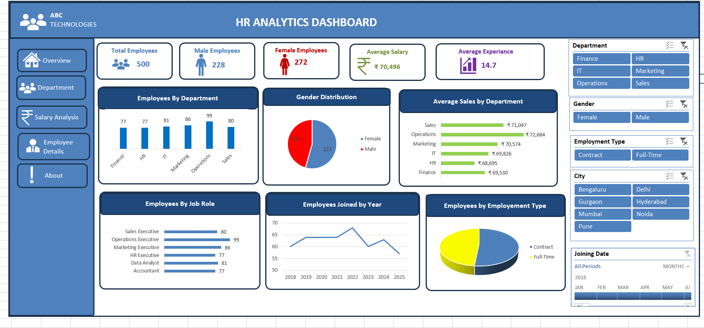
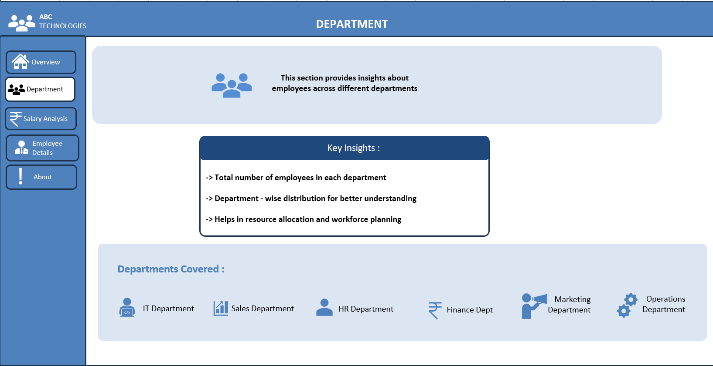
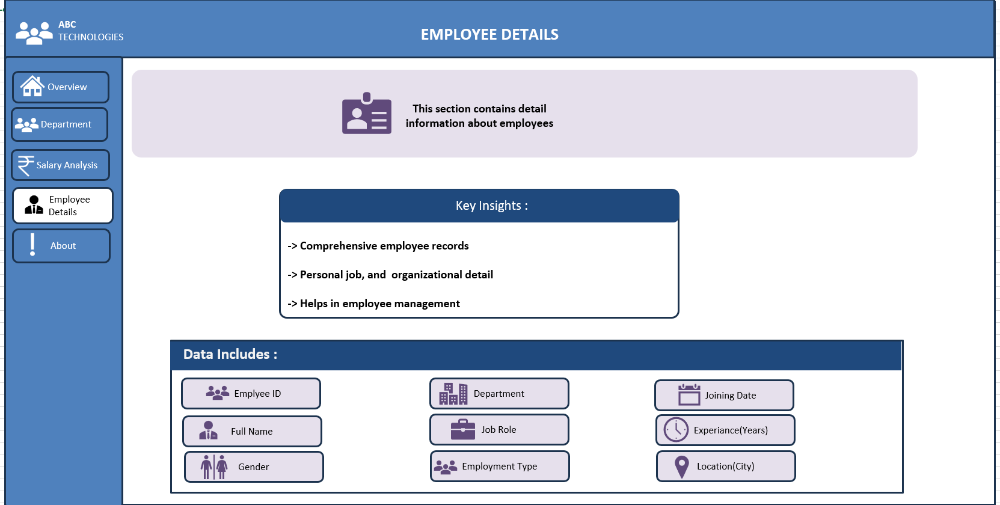

# 📊 HR Analytics Dashboard | Microsoft Excel

## 📌 Project Overview

The **HR Analytics Dashboard** is an interactive dashboard developed in **Microsoft Excel** to help HR teams analyze employee data and make informed business decisions. The dashboard transforms raw HR data into meaningful insights using Pivot Tables, Pivot Charts, KPI Cards, Slicers, and Timelines.

It enables users to monitor workforce distribution, salary trends, hiring patterns, and employee demographics through an interactive and user-friendly interface.

---

## 🎯 Objective

The objective of this project is to build a dynamic HR dashboard that allows users to:

- Monitor workforce statistics
- Analyze department-wise employee distribution
- Compare average salaries across departments
- Track employee hiring trends over time
- Explore employee demographics using interactive filters

---

## 📸 Dashboard Preview

> *(Add your dashboard screenshot here)*





---

## 📊 Key Performance Indicators (KPIs)

- 👥 Total Employees
- 👨 Male Employees
- 👩 Female Employees
- 💰 Average Salary
- 📈 Average Experience

---

## 📈 Dashboard Features

### Employee Analysis
- Employees by Department
- Employees by Job Role
- Employees by Employment Type
- Employees by City

### Salary Analysis
- Average Salary by Department

### Demographic Analysis
- Gender Distribution

### Hiring Analysis
- Employees Joined by Year

### Interactive Filters
- Department
- Gender
- City
- Employment Type
- Joining Date Timeline

---

## 🛠 Tools & Technologies Used

- Microsoft Excel
- Pivot Tables
- Pivot Charts
- Slicers
- Timeline
- Data Cleaning
- Data Validation
- KPI Cards
- Dashboard Design
- Data Visualization

---

## 📂 Dataset Information

The dataset contains employee information including:

- Employee ID
- Employee Name
- Gender
- Age
- Department
- Job Role
- Salary
- Experience
- Joining Date
- City
- Employment Type

---

## 📌 Business Questions Solved

This dashboard helps answer the following business questions:

- How many employees are currently working?
- Which department has the highest number of employees?
- What is the gender distribution of employees?
- Which department offers the highest average salary?
- How has employee hiring changed over the years?
- Which city has the largest workforce?
- What is the average employee experience?
- What is the distribution of employment types?

---

## 📊 Skills Demonstrated

- Data Cleaning
- Data Analysis
- Data Visualization
- Dashboard Development
- Interactive Reporting
- Pivot Tables
- Pivot Charts
- KPI Design
- HR Analytics
- Business Intelligence
- Excel Reporting

---

## 📁 Repository Structure

```
HR-Analytics-Dashboard-Excel
│
├── HR_Analytics_Dashboard.xlsx
├── HR_Analytics_Dataset.xlsx
├── Dashboard.png
├── README.md
└── Screenshots
    └── Dashboard.png
```

---

## 🚀 How to Use

1. Download the Excel workbook.
2. Open the file in Microsoft Excel (2019 or later recommended).
3. Navigate to the **Dashboard** worksheet.
4. Use the **Slicers** and **Timeline** to filter the data interactively.
5. Explore KPIs and charts to gain HR insights.

---

## 💡 Key Learnings

Through this project, I strengthened my skills in:

- Building interactive dashboards in Excel
- Designing KPI cards
- Creating Pivot Tables and Pivot Charts
- Connecting Slicers and Timelines
- Organizing dashboards for business reporting
- Transforming raw HR data into actionable insights

---

## 🎯 Future Improvements

- Add Attrition Analysis
- Add Department-wise Hiring Trends
- Include Employee Performance Metrics
- Automate data refresh using Power Query
- Build the same dashboard in Power BI

---

## 👨‍💻 Author

**Siddharth**

Aspiring Data Analyst passionate about transforming data into actionable business insights through Excel, SQL, Python, and Power BI.

---

⭐ If you found this project useful, consider giving this repository a **Star**.
